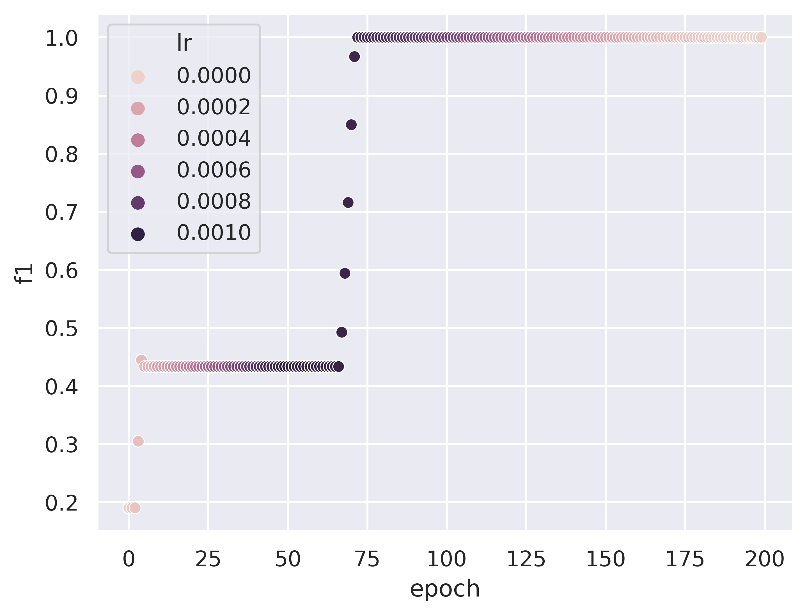

# Introduction 

- [LSTM-keras](lstm_keras_nltk)
- [LSTM-pytorch](lstm_torch_tokenizer)
- [LSTM-without-embedding](lstm_without_embedding)

# Paths
| Train | Test |
| :---------- | :-------------|
|[click here](https://bitbucket.org/nahmed_Ultimus/ai_all-assignments/src/03dd7b0ed8bc2b734835a2ea400620a54e30a6df/dataset/Ultimus%20Work/Commands_with_labels.csv#lines-1)       |   [click here](https://bitbucket.org/nahmed_Ultimus/ai_all-assignments/src/03dd7b0ed8bc2b734835a2ea400620a54e30a6df/dataset/validation_data/val.csv#lines-1 |)

# Main Classifier Results

| | sklearn tfidf+lstm without embedding | keras tokens+lstm with embedding |
|:-----| :-----------------: | :-----------: |
|**Train F1** | | |
| **Val F1** | | |
|**Train Loss** | |  |
| **LR** ||  |
| **Train Conf. Mat** |  [[ 51.,   0.],[  0., 166.]]  |
| **Test Conf. Mat** |  [[0.0, 0.0], [139.0, 1310.0]]  |

# Explanation

Explanations of models are located inside each folder

# Dataset Annotation Strategy

# Training Strategy

|      |
|:--------:|
|Main Classifier will be fixed i.e. **1**  |
||
|Each sub category will have its own trained sub-classifier which will be only trained on that special sub-set. Hence sub-classifiers will be **as many as there are number of sub-categories** |
||
