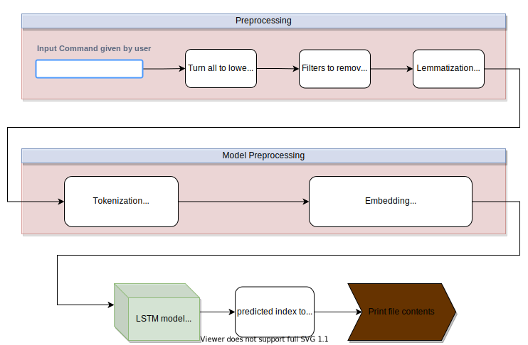

# Table of Contents

- [Introduction](#introduction)
- [Features](#features)
- [How to Train](#how-to-train)
- [How to Predict](#how-to-predict)
- [Scripts and explanation](#scripts)
- [HTML documentation](#html-documentation)

# Introduction

This repo. deals with *keras lstm implementation*.
[This image](#Untitled Diagram.svg) shows the whole flow chart of inference.

# Features

|Feature| Info. |
|------|:-------|
Text Tokenizer | Tokenizer from Tensorflow.Keras 
lemmatization of text | using NLTK library
Architecture | LSTM
Framework | Keras
Embedding | Yes [trained]

# How to Train

>`train_lstm_keras.py` contains the training code. Can be found [here](train_lstm_keras.py)

# How to predict

>`predict.py <command>` predicts and prints the code. File can be found [here](predict.py)

# Scripts

| Script | Information |
|:---------:| :------------|
|**predict.py** | This script is meant for prediction, it loads the [saved tokenizer](tokenizer.pkl) totokenize the *input text command* given by user, performs the **inference** using a script which can be found here [here](predict.py), then decodes the predicted index using [saved label decoder](label_decode.pkl) and prints the *actual code* on screen |
|**train_lstm_keras.py** | Script contains the training code for *LSTM* which trains an embedding. *tf.keras* has been used as the training framework. Script can be found [here](train_lstm_keras.py) |
| **how_to_use_bert.py** | This script demonstrates that how a list of user input commands can be tokenized using the famous algorithm by google called **BERT**. The said algorithm uses builtin tokenizer which has been trained on certain rules and thus tokenizes the sentences based on not only words by also their derivatives and stems. It also deals better with punctuations. Script is located [here](how_to_use_bert.py)

# HTML Documentation

HTML doc. of all the functions used by scripts inside this folder can be found [here](docs/build/html/index.html)
