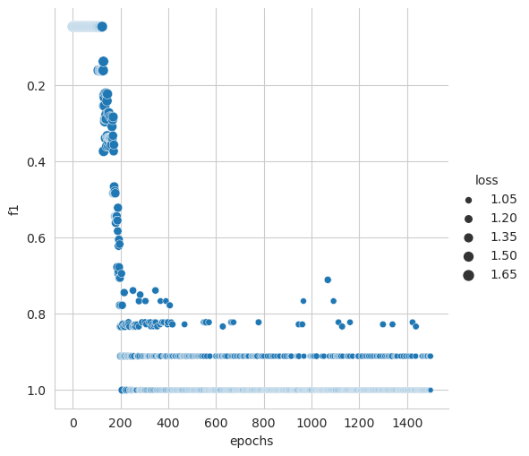
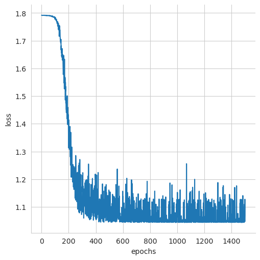
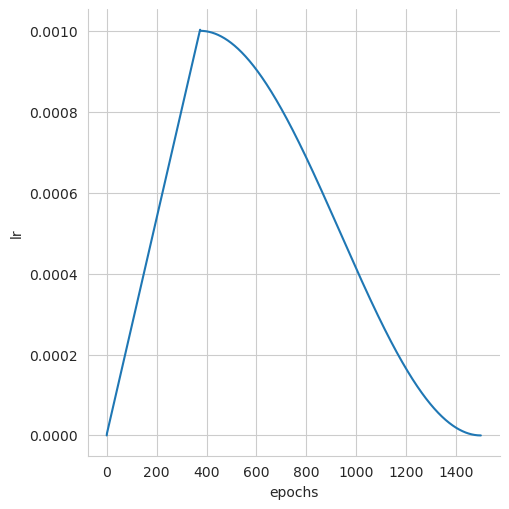
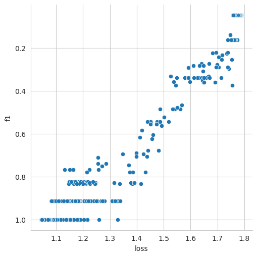

# This is Development Branch

# Table Of Contents

[Introduction](#introduction)
[Updates](#updates)
[Hyperparameters](#hyper-parameters)
[Installation](#installation)
[How To Train](#how-to-train)
[TODO](#todo)
[Results](#results)

# Introduction
This repository uses **stacked-LSTM** architecture using **two** layers to 
train on the given data.

# Updates

- May 28, 2021 ---> Adjusted shapes to enable `bidirectional` LSTM 
- May 28, 2021 ---> LSTM's last output state is used instead of last hidden state, thus using the `pad_packed_sequences`
- May 27, 2021 ---> LSTM's last hidden state is used without `pad_packed_sequence` 

> Images after the training are saved inside `images` folder.

> Uses `tensorflow tokenizer` for tokenization of text.

> Uses embedding for word vectorization. 
# Hyper Parameters
| Parameters | Values |
| :---------- | -------:|
batch          | 12
classes        | 6
dataset        | `dataset/commands2code.csv`
dropout        | 0.5
embed_dim      | 128
epochs         | 100
hidden_1       | 1024
lstm_hidden    | 16
max_norm       | 1.0
num_directions |  2
num_layers     |  2
vocab          | 16

# Installaion
>`pip install -r requirements.txt`
# How To Train
>Set parameters inside `config.yaml` file, also set dataset path. 

> `python train.py` to start training

> Dataset files are located inside the `dataset` folder

# TODO
> Add prediction function which directly takes `text-command` from user.

# Results
|  |
|:-----:|
|Image shows `Epochs vs the F1-score` with size corresponding to the `loss` values| 
||
|Image shows `Epochs vs Loss`| 
||
|Image shows `Epochs vs the Learning-Rate`|
||
|Image shows `Loss vs F1-score`|
||
